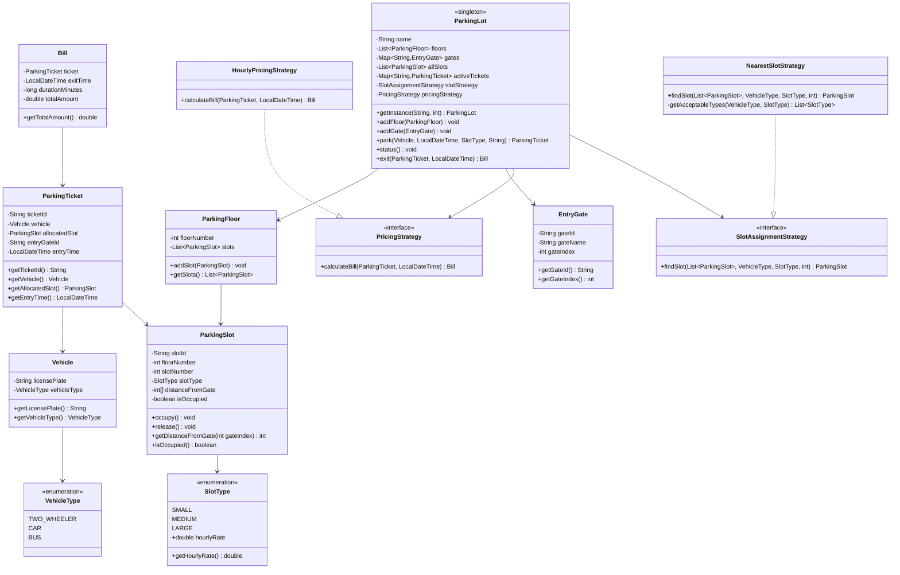

# 🅿️ Multilevel Parking Lot — LLD Design & Implementation

## Design & Approach

### Problem Summary
A multilevel parking lot serving 2-wheelers, cars, and buses across multiple floors and entry gates. The system assigns the **nearest compatible slot** to each vehicle, generates tickets on entry, and bills on exit based on the **slot type** (not vehicle type).

---

## Design Decisions

| Decision | Choice | Reason |
|---|---|---|
| Creational Pattern | **Singleton** for `ParkingLot` | Only one lot instance should exist |
| Behavioral Pattern | **Strategy** for Pricing & Slot Assignment | Open/Closed Principle — swap algorithms without touching core |
| Slot compatibility | Smaller in larger OK, never downgrade | Per requirements |
| Billing unit | Rounded up to nearest hour, minimum 1 hr | Fair billing practice |

### Rates
| Slot Type | Vehicle | Rate |
|---|---|---|
| SMALL | 2-Wheeler | ₹20/hr |
| MEDIUM | Car | ₹40/hr |
| LARGE | Bus | ₹80/hr |

### Slot Compatibility Matrix
| Vehicle ↓ \ Slot → | SMALL | MEDIUM | LARGE |
|---|---|---|---|
| TWO_WHEELER | ✅ | ✅ | ✅ |
| CAR | ❌ | ✅ | ✅ |
| BUS | ❌ | ❌ | ✅ |

---

## Class Diagram



---

## Project Structure

```
Parking_Lot/
├── src/
│   ├── enums/
│   │   ├── VehicleType.java
│   │   └── SlotType.java
│   ├── models/
│   │   ├── Vehicle.java
│   │   ├── ParkingSlot.java
│   │   ├── ParkingTicket.java
│   │   ├── Bill.java
│   │   ├── ParkingFloor.java
│   │   └── EntryGate.java
│   ├── strategy/
│   │   ├── PricingStrategy.java
│   │   ├── HourlyPricingStrategy.java
│   │   ├── SlotAssignmentStrategy.java
│   │   └── NearestSlotStrategy.java
│   ├── ParkingLot.java
│   └── Main.java
└── README.md
```

---

## How to Run

```bash
# Compile
mkdir -p out
javac -d out src/enums/*.java src/models/*.java src/strategy/*.java src/ParkingLot.java src/Main.java

# Run
java -cp out Main
```

---

## API Reference

### `park(vehicle, entryTime, requestedSlotType, entryGateId)`
Parks a vehicle. Returns a `ParkingTicket` with vehicle details, assigned slot, slot type, and entry time. Auto-upgrades to next larger compatible slot if requested type is unavailable.

### `status()`
Prints the current availability (free / total) for each slot type (SMALL, MEDIUM, LARGE).

### `exit(ticket, exitTime)`
Releases the slot, calculates bill based on **slot type rate × hours** (rounded up, min 1 hr), and returns the `Bill`.
