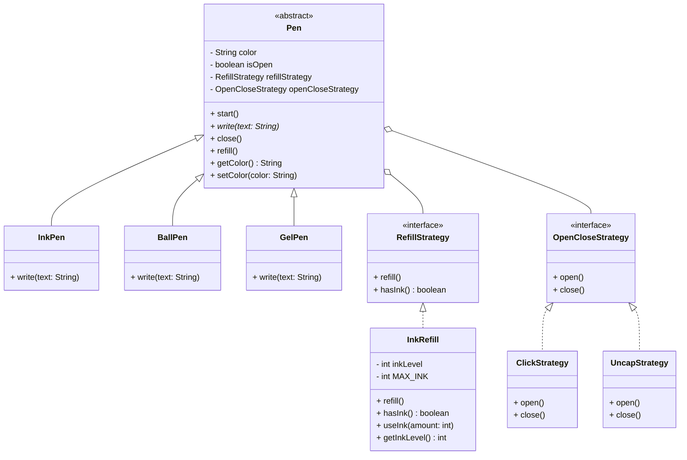

# LLD 101: Design a Pen

## Overview

This project implements a **Pen** using **Object-Oriented Design** principles, specifically the **Strategy Pattern** for flexible and extensible behavior.

### Functionalities
- `start()` — Opens the pen (ready to write)
- `write(text)` — Writes text using available ink
- `close()` — Closes the pen
- `refill()` — Refills the pen's ink

---

## Class Diagram



---

## Design Decisions

| Decision | Rationale |
|---|---|
| **Strategy Pattern** for refill | Different pen types may have different refill cartridges without changing the Pen class |
| **Strategy Pattern** for open/close | Some pens click, others uncap — decoupled from Pen logic |
| **Abstract Pen class** | Common fields (color, isOpen) and state guards (can't write if closed, can't refill if open) live in one place |
| **InkPen / BallPen / GelPen** | Each concrete type can have unique `write()` behavior (e.g., ink consumption rate) |

---

## Project Structure

```
src/
├── strategy/
│   ├── RefillStrategy.java       (interface)
│   ├── InkRefill.java            (concrete refill)
│   ├── OpenCloseStrategy.java    (interface)
│   ├── ClickStrategy.java        (click mechanism)
│   └── UncapStrategy.java        (cap mechanism)
├── pen/
│   ├── Pen.java                  (abstract base)
│   ├── InkPen.java
│   ├── BallPen.java
│   └── GelPen.java
└── Main.java                     (demo)
```

---

## How to Run

```bash
# Compile
javac -d out src/strategy/*.java src/pen/*.java src/Main.java

# Run
java -cp out Main
```
