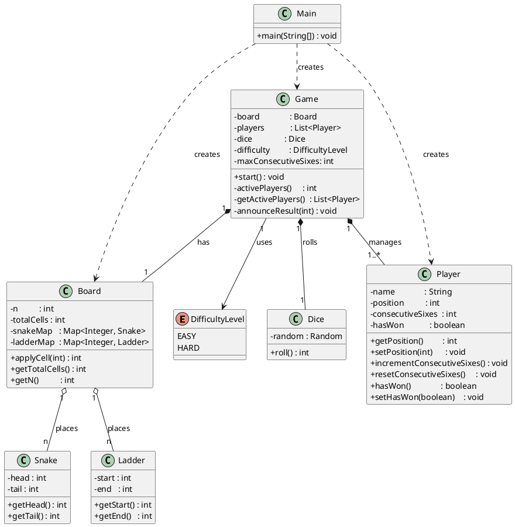

# Snakes & Ladders – Class Diagram

## Relationship Summary

| Class | Role |
|---|---|
| `Main` | Entry point; reads user input, instantiates `Board`, `Player` list, and `Game` |
| `DifficultyLevel` | Enum controlling the consecutive-sixes threshold (EASY→2, HARD→1) |
| `Board` | Creates n×n grid; randomly places n `Snake`s and n `Ladder`s; resolves cell effects |
| `Snake` | Encapsulates head (higher) & tail (lower) positions |
| `Ladder` | Encapsulates start (lower) & end (higher) positions |
| `Dice` | Produces a random 1–6 roll |
| `Player` | Tracks position, consecutive-six streak, and win status |
| `Game` | Orchestrates the turn loop, enforces difficulty rules, detects wins |
